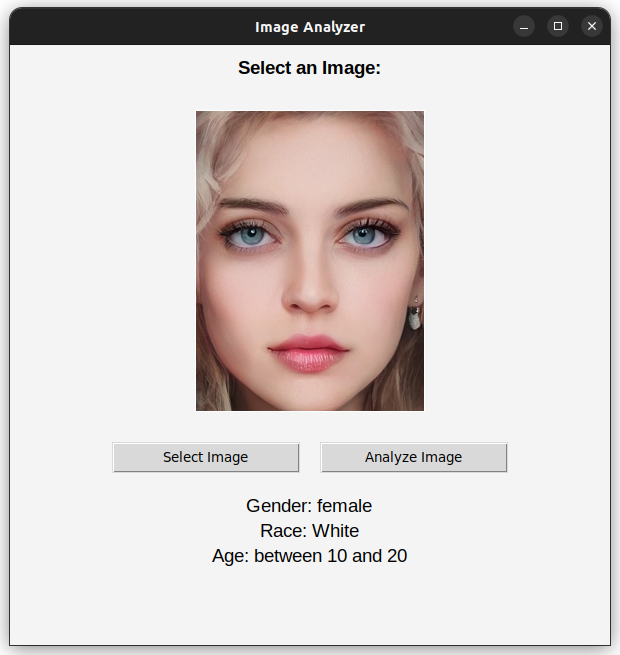
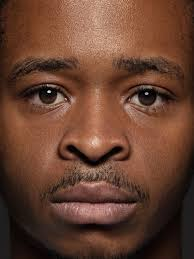

# Age, Gender, Race Predictor

This project is a machine learning-based age, gender, and race predictor using the UTKface dataset and efficientnet models. It provides a graphical user interface (GUI) for users to interact with the predictor and obtain predictions for age, gender, and race based on facial images.

## Table of Contents

- [Demo](#demo)
- [Features](#features)
- [Installation](#installation)
- [Usage](#usage)
- [Dataset](#dataset)
- [Model](#model)
- [Results](#results)
- [Examples](#examples)
- [Model Limitations](#model-limitations)
- [Contributing](#contributing)

## Demo



## Features

List the key features of your age, gender, and race predictor project:

- Prediction of age, gender, and race from facial images.
- Graphical user interface (GUI) for easy interaction.
- Fast and accurate predictions using machine learning models.

## Installation

Provide instructions on how to install and set up the project. Include any dependencies or libraries that need to be installed. For example:

1. Clone the repository:
    ```bash
    $ git clone https://github.com/ARHPA/age-gender-race-predictor.git
    ```

2. Install the required dependencies:
    ```bash
    $ pip install -r requirements.txt
    ```

## Usage

1. Run the application:
    ```bash
    $ python GUI.py
    ```
2. Upload an image.
3. Click on the "analyze" button to obtain predictions for age, gender, and race.

## Dataset

The UTKface dataset is a large-scale face dataset with annotations for age, gender, and race. It contains 8000 samples and Landmarks are available in TXT format. The dataset includes images of individuals from diverse age groups, genders, and racial backgrounds. The faces have been cropped and aligned for consistent input to the model.

## Model

The age, gender, and race prediction models used in this project are based on state-of-the-art EfficientNet architectures.

### Gender and Race Prediction Model (EfficientNetV3)

The gender prediction model is based on EfficientNetV3, which is a powerful convolutional neural network architecture known for its efficiency and accuracy. All layers have been pre-trained on a large-scale dataset.

### Age Prediction Model (EfficientNetV5)

The age and race prediction model utilizes EfficientNetV5, another advanced convolutional neural network architecture. EfficientNetV5 is specifically designed for image classification tasks and has achieved superior performance on various benchmarks. It has been pretrained on a diverse range of data.

The training process involved optimizing the models' hyperparameters, such as learning rate, batch size, and optimizer choice, to maximize their performance on age, gender, and race prediction tasks.

The models' training was conducted for 10 epochs, leveraging techniques like data augmentation and regularization to prevent overfitting and improve generalization.

The resulting trained models demonstrate good accuracy and robustness in predicting age, gender, and race from facial images.

## Results

The model achieved an overall accuracy of 88% on the test set for gender prediction, 84% for race prediction. It also achieved 0.54 loss on the test set for age.

## Examples

Provide some examples of the predictions made by your model. Include images along with the corresponding predicted age, gender, and race labels. For example:

| Image                          | Predicted Age | Predicted Gender | Predicted Race |
|--------------------------------|---------------|------------------|----------------|
|  | (20, 30)      | Male             | Indian         |
|   | (30, 40)      | Female           | others         |
|   | (20, 30)      | Male             | Black          |

## Model Limitations
Please keep in mind that the image analysis model has some limitations, which can affect its accuracy. Due to these limitations, the model may not always provide perfect predictions for age, gender, and race. Despite efforts to address these challenges during development and training, achieving high accuracy in such predictions is a complex task influenced by various factors.

- Incorrect Labels in the Dataset: The dataset used to train the model may contain some incorrect or inaccurate labels. As a result, there might be instances where the predicted age, gender, or race may not accurately represent the actual attributes of the person in the image.

- Challenges with Gender Detection for Babies: Detecting the gender of babies (under 7 years old) can be challenging due to the limited development of gender-specific physical characteristics at an early age. The model may have difficulty accurately determining the gender for this age group.

- Difficulty Distinguishing Black People from Indian and White People from Others: The model may face challenges when distinguishing between individuals of different races, particularly when it comes to distinguishing black people from Indian people or white people from others. These races may exhibit similarities in certain facial features, leading to potential misclassifications.

- Dependence on Training Data: The accuracy of the age, gender, and race predictions heavily relies on the quality and diversity of the training data used. If the training data is not representative of all age groups, genders, and races, the model's performance may be limited in accurately predicting these attributes.

## Contributing

Contributions to this project are welcome! If you encounter any issues or have suggestions for improvements, please [open an issue](https://github.com/ARHPA/age-gender-race-predictor/issues/new). If you would like to contribute code, please fork the repository and submit a pull request.

